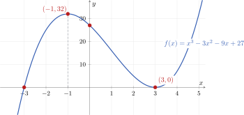
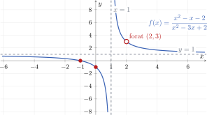
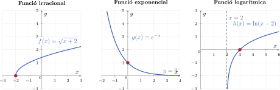
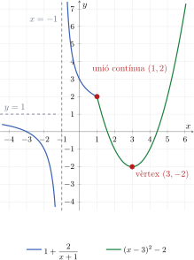
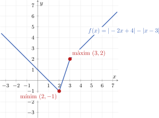

# Representació de funcions

!!! abstract "Definició: representació d'una funció"
    Representar una funció consisteix a reunir la informació algebraica, els límits i les derivades per dibuixar-ne una gràfica coherent.

Seguirem sempre el mateix ordre per representar funcions **polinòmiques, racionals, irracionals, exponencials, logarítmiques i funcions a trossos**.

!!! note "Guió general: vuit passos per representar una funció"
    1. Determinar el **domini**, tenint en compte els denominadors, les arrels d'índex parell i els logaritmes.
    2. Trobar el tall amb l'eix $Y$ calculant $f(0)$.
    3. Trobar els talls amb l'eix $X$ resolent $f(x)=0$.
    4. Buscar les **asímptotes verticals** als extrems finits del domini mitjançant els límits laterals.
    5. Estudiar les altres **discontinuïtats**, especialment en funcions a trossos, i classificar-les.
    6. Calcular els límits quan $x\to-\infty$ i $x\to+\infty$ per trobar asímptotes horitzontals o branques infinites.
    7. Localitzar els candidats a **extrem relatiu** resolent $f'(x)=0$ i considerant els punts on $f'$ no existeix.
    8. Construir la **taula de monotonia** situant-hi tots els punts importants: discontinuïtats —incloses les asímptotes verticals—, extrems del domini, punts d'unió de les funcions a trossos i candidats a extrems relatius. Després, estudiar el signe de $f'$ en cada interval per determinar on la funció creix o decreix.

## 1. Esquema general

### Pas 1. Domini

!!! abstract "Definició: domini"
    El **domini** és el conjunt de valors de $x$ per als quals la funció està definida.

| Tipus de funció | Condició del domini |
|:---|:---|
| Polinòmica | $D_f=\mathbb{R}$. |
| Racional $\dfrac{P(x)}{Q(x)}$ | $Q(x)\neq0$. |
| Arrel d'índex parell $\sqrt[n]{g(x)}$ | $g(x)\geq0$. |
| Arrel d'índex senar | No imposa cap restricció. |
| Logarítmica $\log_a(g(x))$ | $g(x)>0$. |
| Exponencial $a^{g(x)}$ | Està definida sempre que ho estigui $g(x)$. |
| Funció a trossos | S'uneixen els dominis de cada expressió dins del seu interval. |

!!! note "Recorda"
    No es pot dividir entre zero. Tampoc es pot calcular, en els nombres reals, una arrel d'índex parell d'un nombre negatiu ni el logaritme d'un nombre menor o igual que zero.

### Pas 2. Tall amb l'eix d'ordenades

Per trobar el tall amb l'eix $Y$, substituïm $x=0$:

$$
y=f(0).
$$

El punt és $(0,f(0))$, sempre que $0$ pertanyi al domini.

### Pas 3. Talls amb l'eix d'abscisses

Per trobar els talls amb l'eix $X$, imposem $y=0$ i resolem

$$
f(x)=0.
$$

En una funció racional, els zeros són els del numerador que també pertanyen al domini.

### Pas 4. Asímptotes verticals

Els candidats són els extrems finits del domini, sovint els zeros del denominador o els punts on l'argument d'un logaritme s'apropa a zero. Per a cada candidat $x=c$, calculem

$$
\lim_{x\to c^-}f(x)
\qquad\text{i}\qquad
\lim_{x\to c^+}f(x).
$$

!!! abstract "Definició: asímptota vertical"
    La recta $x=c$ és una **asímptota vertical** si almenys un dels límits laterals de $f(x)$ quan $x\to c$ és $+\infty$ o $-\infty$.

!!! warning "Un zero del denominador no sempre és una asímptota"
    Si el mateix factor es pot simplificar en el numerador i el denominador i el límit és finit, hi ha una discontinuïtat evitable, no una asímptota vertical.

### Pas 5. Altres discontinuïtats

En funcions a trossos i en punts exclosos del domini, comparem els límits laterals i el valor de la funció.

!!! abstract "Definició: tipus de discontinuïtat"
    - **Evitable:** el límit existeix i és finit, però el valor de la funció no existeix o és diferent.
    - De **salt finit:** els dos límits laterals són finits, però diferents.
    - De **salt infinit:** almenys un dels límits laterals és infinit.

### Pas 6. Comportament a l'infinit i asímptotes

Calculem

$$
\lim_{x\to-\infty}f(x)
\qquad\text{i}\qquad
\lim_{x\to+\infty}f(x).
$$

!!! abstract "Definició: asímptota horitzontal"
    La recta $y=L$ és una **asímptota horitzontal** si

    $$
    \lim_{x\to-\infty}f(x)=L
    \qquad\text{o}\qquad
    \lim_{x\to+\infty}f(x)=L.
    $$

### Pas 7. Extrems relatius

!!! abstract "Definició: màxim i mínim relatius"
    Una funció té un **màxim relatiu** en $x=a$ si $f(a)$ és més gran que els valors propers. Té un **mínim relatiu** si $f(a)$ és més petit que els valors propers.

Calculem $f'(x)$ i estudiem els punts del domini on

$$
f'(x)=0
\qquad\text{o bé}\qquad
f'(x)\text{ no existeix}.
$$

El canvi de signe de $f'$ permet decidir si hi ha un màxim, un mínim o cap extrem.

### Pas 8. Creixement i decreixement

Abans d'estudiar el signe de $f'$, situem ordenadament a la taula de monotonia **tots els punts que poden separar intervals**:

- les discontinuïtats, incloses les **asímptotes verticals**;
- els extrems del domini;
- els punts d'unió o de canvi d'expressió de les **funcions a trossos**;
- els punts on $f'(x)=0$ i els punts del domini on $f'$ no existeix, que són els candidats a **extrems relatius**.

Aquests punts divideixen el domini en intervals. En cadascun estudiem el signe de $f'$:

$$
f'(x)>0\Longrightarrow f\text{ creix},
\qquad
f'(x)<0\Longrightarrow f\text{ decreix}.
$$

El canvi de signe de $f'$ permet classificar els candidats: de $+$ a $-$ hi ha un màxim relatiu i de $-$ a $+$ hi ha un mínim relatiu. Una discontinuïtat o una asímptota vertical separa intervals de monotonia, encara que el punt no pertanyi al domini i, per tant, no pugui ser un extrem relatiu.

!!! tip "Abans de dibuixar"
    Situa primer els talls, les discontinuïtats, les asímptotes i els extrems. Després uneix la informació respectant el creixement o decreixement de cada interval.

## 2. Què cal mirar segons el tipus de funció?

| Tipus | Informació especialment útil |
|:---|:---|
| Polinòmica | Domini $\mathbb{R}$, talls, comportament del terme de grau més alt i extrems. No té asímptotes. |
| Racional | Zeros del denominador, simplificacions, asímptotes verticals o horitzontals i intervals separats pel domini. |
| Irracional | Condició del radicand, extrems del domini i possibles tangents verticals. |
| Exponencial | El factor exponencial és sempre positiu; els límits depenen del signe de l'exponent. |
| Logarítmica | L'argument ha de ser positiu i acostuma a haver-hi una asímptota vertical quan l'argument tendeix a $0^+$. |
| A trossos | Cal estudiar la continuïtat i la derivabilitat en tots els punts d'unió. |
| Amb valor absolut | Primer s'escriu a trossos segons el signe de l'expressió interior. |

## 3. Exemple complet: funció polinòmica

!!! example "Exemple 1. Representació d'una funció polinòmica"
    Estudiem

    $$
    f(x)=x^3-3x^2-9x+27.
    $$

    **Domini i talls.** El domini és $\mathbb{R}$. Factoritzem:

    $$
    f(x)=(x-3)^2(x+3).
    $$

    Per tant, talla l'eix $X$ en $(-3,0)$ i $(3,0)$, i l'eix $Y$ en $(0,27)$. En $x=3$ l'arrel és doble: la gràfica toca l'eix però no el travessa.

    **Comportament a l'infinit.** El terme dominant és $x^3$:

    $$
    \lim_{x\to-\infty}f(x)=-\infty,
    \qquad
    \lim_{x\to+\infty}f(x)=+\infty.
    $$

    Una funció polinòmica no té asímptotes.

    **Creixement i extrems.**

    $$
    f'(x)=3x^2-6x-9=3(x+1)(x-3).
    $$

    | Interval | $(-\infty,-1)$ | $(-1,3)$ | $(3,+\infty)$ |
    |:---:|:---:|:---:|:---:|
    | $f'$ | $+$ | $-$ | $+$ |
    | $f$ | creix | decreix | creix |

    Hi ha un màxim relatiu en $(-1,32)$ i un mínim relatiu en $(3,0)$.

    <figure markdown="span">
      { width="820" }
      <figcaption><strong><a href="https://github.com/albertcid-PA/Matematiques2BAT-MACS/blob/main/figures/tikz/analisi/fig_2_10_representacio_polinomica.tex">Figura 2.10.</a></strong> Representació de la funció polinòmica.</figcaption>
    </figure>

## 4. Exemple complet: funció racional

!!! example "Exemple 2. Representació d'una funció racional"
    Estudiem

    $$
    f(x)=\frac{x^2-x-2}{x^2-3x+2}.
    $$

    **Domini i talls.**

    $$
    f(x)=\frac{(x-2)(x+1)}{(x-2)(x-1)},
    \qquad
    D_f=\mathbb{R}\setminus\{1,2\}.
    $$

    Per als valors del domini podem simplificar el factor $x-2$:

    $$
    f(x)=\frac{x+1}{x-1},
    \qquad x\neq1,2.
    $$

    El tall amb l'eix $X$ és $(-1,0)$ i el tall amb l'eix $Y$ és $(0,-1)$.

    **Discontinuïtat evitable en $x=2$.** Tot i que $f(2)$ no existeix, el factor que provoca la indeterminació es pot simplificar i

    $$
    \lim_{x\to2}f(x)=\frac{2+1}{2-1}=3.
    $$

    Per tant, la gràfica té un forat en el punt $(2,3)$.

    **Discontinuïtat asimptòtica en $x=1$.** El factor $x-1$ no es pot simplificar i

    $$
    \lim_{x\to1^-}f(x)=-\infty,
    \qquad
    \lim_{x\to1^+}f(x)=+\infty.
    $$

    Per tant, $x=1$ és una asímptota vertical.

    **Comportament a l'infinit.** Com que el numerador i el denominador tenen el mateix grau,

    $$
    \lim_{x\to-\infty}f(x)=1,
    \qquad
    \lim_{x\to+\infty}f(x)=1.
    $$

    Així, $y=1$ és una asímptota horitzontal.

    **Creixement i extrems.**

    $$
    f'(x)=\frac{-2}{(x-1)^2}<0
    $$

    en tot el domini. La taula de monotonia ha d'incloure tant l'asímptota vertical $x=1$ com la discontinuïtat evitable $x=2$:

    | Interval | $(-\infty,1)$ | $(1,2)$ | $(2,+\infty)$ |
    |:---:|:---:|:---:|:---:|
    | $f'$ | $-$ | $-$ | $-$ |
    | $f$ | decreix | decreix | decreix |

    La funció no té extrems relatius.

    <figure markdown="span">
      { width="820" }
      <figcaption><strong><a href="https://github.com/albertcid-PA/Matematiques2BAT-MACS/blob/main/figures/tikz/analisi/fig_2_11_representacio_racional.tex">Figura 2.11.</a></strong> Funció racional amb una discontinuïtat evitable i una discontinuïtat asimptòtica.</figcaption>
    </figure>

## 5. Funcions irracionals, exponencials i logarítmiques

En aquestes funcions el domini i els límits acostumen a determinar bona part de la gràfica.

!!! example "Exemple 3. Tres comprovacions essencials"
    **Funció irracional:** per a $f(x)=\sqrt{x+2}$, el domini és $[-2,+\infty)$ i la gràfica comença en $(-2,0)$.

    **Funció exponencial:** per a $g(x)=e^{-x}$,

    $$
    \lim_{x\to-\infty}g(x)=+\infty,
    \qquad
    \lim_{x\to+\infty}g(x)=0,
    $$

    de manera que $y=0$ és una asímptota horitzontal cap a $+\infty$.

    **Funció logarítmica:** per a $h(x)=\ln(x-2)$, el domini és $(2,+\infty)$ i

    $$
    \lim_{x\to2^+}\ln(x-2)=-\infty,
    $$

    de manera que $x=2$ és una asímptota vertical.

    <figure markdown="span">
      { width="960" }
      <figcaption><strong><a href="https://github.com/albertcid-PA/Matematiques2BAT-MACS/blob/main/figures/tikz/analisi/fig_2_12_representacio_irracional_exponencial_logaritmica.tex">Figura 2.12.</a></strong> Representació de les funcions irracional, exponencial i logarítmica de l'exemple.</figcaption>
    </figure>

## 6. Funcions a trossos i amb valor absolut

En una funció a trossos, cada expressió només es dibuixa dins del seu interval. En els punts d'unió cal comprovar:

1. els límits laterals;
2. el valor de la funció;
3. les derivades laterals, si s'estudia la derivabilitat.

Per a una funció amb valor absolut, primer localitzem els zeros de l'expressió interior i l'escrivim a trossos:

$$
|g(x)|=
\begin{cases}
g(x), & g(x)\geq0,\\
-g(x), & g(x)<0.
\end{cases}
$$

!!! note "Dibuix final"
    Els cercles buits indiquen que el punt no pertany al tros corresponent; els punts plens indiquen el valor real de la funció. La gràfica no s'ha de prolongar fora de l'interval assignat a cada expressió.

!!! example "Exemple 4. Funció a trossos amb una discontinuïtat asimptòtica"
    Representem la funció

    $$
    f(x)=
    \begin{cases}
    1+\dfrac{2}{x+1}, & x<1,\\[6pt]
    (x-3)^2-2, & x\geq1.
    \end{cases}
    $$

    **Domini i discontinuïtat asimptòtica.** La branca racional no està definida en $x=-1$. Com que

    $$
    \lim_{x\to-1^-}\left(1+\frac{2}{x+1}\right)=-\infty
    \qquad\text{i}\qquad
    \lim_{x\to-1^+}\left(1+\frac{2}{x+1}\right)=+\infty,
    $$

    la funció té una **discontinuïtat asimptòtica** i una asímptota vertical en $x=-1$. Per tant,

    $$
    D_f=\mathbb{R}\setminus\{-1\}.
    $$

    **Talls amb els eixos.** El tall amb l'eix $Y$ és $(0,3)$. Els talls amb l'eix $X$ són

    $$
    (-3,0),\qquad (3-\sqrt2,0)\qquad\text{i}\qquad(3+\sqrt2,0).
    $$

    **Continuïtat en el punt d'unió.** En $x=1$, els dos trossos coincideixen:

    $$
    \lim_{x\to1^-}f(x)=1+\frac{2}{1+1}=2,
    \qquad
    \lim_{x\to1^+}f(x)=(1-3)^2-2=2=f(1).
    $$

    Així, $f$ és **contínua en $x=1$**.

    **Comportament a l'infinit.** Quan $x\to-\infty$ s'aplica la branca racional, mentre que quan $x\to+\infty$ s'aplica la branca quadràtica:

    $$
    \lim_{x\to-\infty}f(x)
    =\lim_{x\to-\infty}\left(1+\frac{2}{x+1}\right)=1,
    $$

    $$
    \lim_{x\to+\infty}f(x)
    =\lim_{x\to+\infty}\left((x-3)^2-2\right)=+\infty.
    $$

    Per tant, $y=1$ és una **asímptota horitzontal quan $x\to-\infty$**. Cap a $+\infty$, la branca quadràtica creix indefinidament.

    **Derivabilitat en el punt d'unió.** Derivem cada tros:

    $$
    f'(x)=
    \begin{cases}
    -\dfrac{2}{(x+1)^2}, & x<1,\\[6pt]
    2(x-3), & x>1.
    \end{cases}
    $$

    Les derivades laterals en $x=1$ són

    $$
    f'(1^-)=-\frac12
    \qquad\text{i}\qquad
    f'(1^+)=-4.
    $$

    Com que no coincideixen, $f$ és **contínua però no derivable en $x=1$**: la gràfica presenta un punt angulós en $(1,2)$.

    **Vèrtex i monotonia.** La branca quadràtica està escrita en forma canònica,

    $$
    (x-3)^2-2,
    $$

    i té el vèrtex en $(3,-2)$, que és un mínim relatiu. Per estudiar la monotonia situem a la taula l'asímptota $x=-1$, el punt d'unió $x=1$ i el vèrtex $x=3$:

    | Interval | $(-\infty,-1)$ | $(-1,1)$ | $(1,3)$ | $(3,+\infty)$ |
    |:---:|:---:|:---:|:---:|:---:|
    | Signe de $f'(x)$ | $-$ | $-$ | $-$ | $+$ |
    | Comportament | decreix | decreix | decreix | creix |

    <figure markdown="span">
      { width="560" }
      <figcaption><strong><a href="https://github.com/albertcid-PA/Matematiques2BAT-MACS/blob/main/figures/tikz/analisi/fig_2_13_representacio_funcio_trossos.tex">Figura 2.13.</a></strong> Funció a trossos contínua però no derivable en el punt d'unió.</figcaption>
    </figure>

!!! example "Exemple 5. Representació d'una funció amb dos valors absoluts"
    Representem la funció

    $$
    f(x)=|-2x+4|-|x-3|.
    $$

    Els canvis de signe de les expressions interiors es produeixen en

    $$
    -2x+4=0\Longrightarrow x=2,
    \qquad
    x-3=0\Longrightarrow x=3.
    $$

    Construïm una taula per decidir si cal conservar o canviar el signe de cada expressió:

    | | $(-\infty,2)$ | $2$ | $(2,3)$ | $3$ | $(3,+\infty)$ |
    |:---|:---:|:---:|:---:|:---:|:---:|
    | Signe de $-2x+4$ | $+$ | $0$ | $-$ | $-$ | $-$ |
    | $\lvert-2x+4\rvert$ | $+(-2x+4)$ | $0$ | $-(-2x+4)$ | $-(-2x+4)$ | $-(-2x+4)$ |
    | Signe de $x-3$ | $-$ | $-$ | $-$ | $0$ | $+$ |
    | $-\lvert x-3\rvert$ | $+(x-3)$ | $+(x-3)$ | $+(x-3)$ | $0$ | $-(x-3)$ |

    Per tant,

    $$
    f(x)=
    \begin{cases}
    -x+1, & x<2,\\
    3x-7, & 2\leq x<3,\\
    x-1, & x\geq3.
    \end{cases}
    $$

    **Comportament a l'infinit.** Als extrems utilitzem el primer i el tercer tros, respectivament:

    $$
    \lim_{x\to-\infty}f(x)
    =\lim_{x\to-\infty}(-x+1)=+\infty,
    $$

    $$
    \lim_{x\to+\infty}f(x)
    =\lim_{x\to+\infty}(x-1)=+\infty.
    $$

    Per tant, la funció creix sense límit als dos extrems i no té asímptotes horitzontals.

    Els tres trossos són rectes. En els punts de canvi,

    $$
    f(2)=-1
    \qquad\text{i}\qquad
    f(3)=2,
    $$

    i les expressions dels dos costats donen el mateix valor. Així, la funció és contínua en tot $\mathbb{R}$.

    En canvi, els pendents són

    $$
    -1,\qquad 3\qquad\text{i}\qquad1.
    $$

    Com que el pendent canvia, $f$ **no és derivable en $x=2$ ni en $x=3$**. La gràfica té un mínim relatiu en $(2,-1)$ i un màxim relatiu en $(3,2)$.

    <figure markdown="span">
      { width="760" }
      <figcaption><strong><a href="https://github.com/albertcid-PA/Matematiques2BAT-MACS/blob/main/figures/tikz/analisi/fig_2_14_representacio_dos_valors_absoluts.tex">Figura 2.14.</a></strong> Representació de $f(x)=|-2x+4|-|x-3|$.</figcaption>
    </figure>
