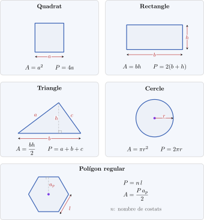
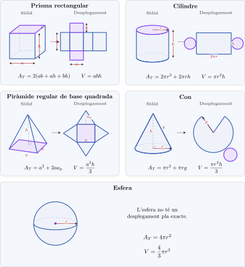

# Optimització de funcions

En els problemes d'optimització sovint cal expressar longituds, àrees o volums en funció d'una variable. Per això, abans de plantejar-los, recordem les fórmules geomètriques més habituals.

## 1. Repàs de geometria

### 1.1 Geometria plana

En les figures planes utilitzarem $A$ per indicar l'**àrea** i $P$ per indicar el **perímetre**.

<figure markdown="span">
  { width="900" }
  <figcaption><strong><a href="https://github.com/albertcid-PA/Matematiques2BAT-MACS/blob/main/figures/tikz/analisi/fig_2_16_repas_geometria_plana.tex">Figura 2.16.</a></strong> Àrees i perímetres de les figures planes més habituals.</figcaption>
</figure>

| Figura | Àrea | Perímetre |
|:---|:---:|:---:|
| Quadrat de costat $a$ | $A=a^2$ | $P=4a$ |
| Rectangle de base $b$ i altura $h$ | $A=bh$ | $P=2(b+h)$ |
| Triangle de base $b$, altura $h$ i costats $a,b,c$ | $A=\dfrac{bh}{2}$ | $P=a+b+c$ |
| Cercle de radi $r$ | $A=\pi r^2$ | $P=2\pi r$ |

!!! note "Perímetre o longitud de la circumferència"
    En el cercle, $2\pi r$ és la longitud de la **circumferència**, és a dir, la frontera del cercle.

### 1.2 Geometria de l'espai

En els cossos geomètrics només necessitarem les fórmules del **volum**. Escriurem $A_b$ per indicar l'àrea de la base i $h$ per indicar l'altura.

<figure markdown="span">
  { width="960" }
  <figcaption><strong><a href="https://github.com/albertcid-PA/Matematiques2BAT-MACS/blob/main/figures/tikz/analisi/fig_2_17_repas_geometria_espai.tex">Figura 2.17.</a></strong> Fórmules generals del volum.</figcaption>
</figure>

| Tipus de cos | Volum |
|:---|:---:|
| Prisma o cilindre | $V=A_bh$ |
| Piràmide o con acabat en punta | $V=\dfrac{A_bh}{3}$ |
| Esfera de radi $r$ | $V=\dfrac{4}{3}\pi r^3$ |

!!! note "Àrea de la base"
    La fórmula concreta depèn de la forma de la base. Per exemple, si la base és un cercle de radi $r$, aleshores $A_b=\pi r^2$.

## 2. Contingut que treballarem

- Elecció de la variable i traducció de l'enunciat.
- Funció que cal optimitzar i domini del problema.
- Obtenció i comprovació del màxim o del mínim.
- Interpretació de la solució en el context de l'enunciat.
- Problemes PAU.
