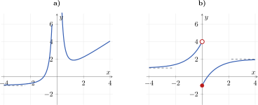
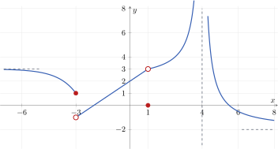
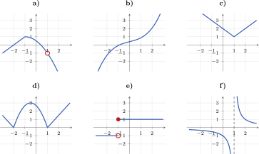
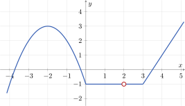

# Exercicis d'anàlisi

En aquesta pàgina es reuneixen tots els exercicis del bloc d'anàlisi. La primera xifra identifica el tema i la segona, l'exercici: per exemple, l'exercici **1.3** és el tercer exercici del tema 1.

## Tema 1. Repàs de límits i derivades

### Interpretació gràfica dels límits

**1.1.** Observa les dues gràfiques i determina, en cada cas:

$$
\lim_{x\to0^-}f(x),
\qquad
\lim_{x\to0^+}f(x),
\qquad
\lim_{x\to-\infty}f(x)
\qquad\text{i}\qquad
\lim_{x\to+\infty}f(x).
$$

<figure markdown="span">
  { width="850" }
  <figcaption><strong><a href="https://github.com/albertcid-PA/Matematiques2BAT-MACS/blob/main/figures/tikz/analisi/fig_1_5_exercici_limits_dues_grafiques.tex">Figura 1.5.</a></strong> Lectura de límits laterals i límits a l'infinit.</figcaption>
</figure>

**1.2.** A partir de la gràfica, calcula els valors següents:

<figure markdown="span">
  { width="820" }
  <figcaption><strong><a href="https://github.com/albertcid-PA/Matematiques2BAT-MACS/blob/main/figures/tikz/analisi/fig_1_6_exercici_lectura_limits.tex">Figura 1.6.</a></strong> Gràfica de l'exercici 1.2.</figcaption>
</figure>

| | | |
|:--|:--|:--|
| **a)** $\displaystyle\lim_{x\to-\infty}f(x)$ | **b)** $\displaystyle\lim_{x\to-3^-}f(x)$ | **c)** $\displaystyle\lim_{x\to-3^+}f(x)$ |
| **d)** $\displaystyle\lim_{x\to-3}f(x)$ | **e)** $\displaystyle\lim_{x\to1}f(x)$ | **f)** $f(1)$ |
| **g)** $\displaystyle\lim_{x\to4^-}f(x)$ | **h)** $\displaystyle\lim_{x\to4^+}f(x)$ | **i)** $\displaystyle\lim_{x\to+\infty}f(x)$ |

### Càlcul de límits

**1.3.** Calcula els límits següents quan $x\to+\infty$:

| | |
|:--|:--|
| **a)** $\displaystyle\lim_{x\to+\infty}\frac{3x^2-2x+1}{(x-2)^2}$ | **b)** $\displaystyle\lim_{x\to+\infty}\frac{2x+\ln x}{\ln x}$ |
| **c)** $\displaystyle\lim_{x\to+\infty}\frac{5+3^x}{2\cdot3^x+1}$ | **d)** $\displaystyle\lim_{x\to+\infty}\frac{4\cdot2^x}{2^x+3}$ |
| **e)** $\displaystyle\lim_{x\to+\infty}\frac{x^2-4}{x^3+1}$ | **f)** $\displaystyle\lim_{x\to+\infty}\frac{3x-1}{\sqrt{4x^2+5}}$ |
| **g)** $\displaystyle\lim_{x\to+\infty}\left(5^x-4x^6\right)$ | **h)** $\displaystyle\lim_{x\to+\infty}\left(\frac{x^2}{x-1}-\frac{x^3}{x^2+2}\right)$ |

**1.4.** Calcula els límits. Si algun és infinit, calcula'n també els límits laterals.

| | |
|:--|:--|
| **a)** $\displaystyle\lim_{x\to2}\frac{x^2-5x+6}{2-x}$ | **b)** $\displaystyle\lim_{x\to-1}\frac{x^3+1}{(x+1)(x-2)}$ |
| **c)** $\displaystyle\lim_{x\to0}\frac{x^3-4x^2}{2x^2+6x}$ | **d)** $\displaystyle\lim_{x\to3}\frac{x^2+x-12}{x^3-5x^2+3x+9}$ |

### Estudi global de funcions

**1.5.** Considera la funció

$$
f(x)=\frac{x+2}{x^2+x-2}.
$$

- **a)** Calcula els límits de $f(x)$ quan $x\to0$, $x\to-2$, $x\to1$, $x\to+\infty$ i $x\to-\infty$. Quan calgui, estudia els límits laterals.
- **b)** Indica les asímptotes i les discontinuïtats de la funció.
- **c)** Representa gràficament els resultats.

**1.6.** Considera la funció

$$
g(x)=\frac{x^2-16}{x^2-4x}.
$$

- **a)** Determina el domini i calcula els límits en els punts on la funció no està definida.
- **b)** Calcula els límits quan $x\to+\infty$ i quan $x\to-\infty$.
- **c)** Classifica les discontinuïtats, indica les asímptotes i representa la funció amb la informació obtinguda.

### Continuïtat

**1.7.** Considera la funció

$$
f(x)=
\begin{cases}
\dfrac{x-2}{(x-3)(x-4)}, & x\leq2,\\[6pt]
\dfrac{x^2-5}{(x+2)(x-2)}, & x>2.
\end{cases}
$$

- **a)** Estudia'n la continuïtat en $x=2$ i classifica la discontinuïtat, si n'hi ha.
- **b)** Calcula $\displaystyle\lim_{x\to+\infty}f(x)$ i $\displaystyle\lim_{x\to-\infty}f(x)$.

**1.8.** En un institut s'inicia una campanya per reduir el consum d'aigua. L'estalvi acumulat ve donat per

$$
A(t)=
\begin{cases}
e^{0{,}03t}, & 1\leq t\leq60,\\[4pt]
-\dfrac{t}{30}+8, & 60<t\leq180,
\end{cases}
$$

on $t$ és el nombre de dies transcorreguts i $A(t)$ és l'estalvi expressat en milers de litres.

- **a)** Estudia la continuïtat d'$A(t)$.
- **b)** Explica què passa quan han transcorregut $60$ dies.
- **c)** En quins moments l'estalvi és de $4\,000$ litres?

### Derivada en un punt

**1.9.** Calcula la derivada de cada funció. Quan s'indiqui un punt, calcula també el valor de la derivada en aquest punt.

| | |
|:--|:--|
| **a)** $f(x)=x^3$ | **b)** $f(x)=x^2-3x$, en $x=2$ |
| **c)** $f(x)=\sqrt{x+5}$, en $x=4$ | **d)** $f(x)=e^{2x}$, en $x=0$ |

### Derivades elementals

**1.10.** Calcula la derivada de les funcions següents:

| | |
|:--|:--|
| **a)** $f(x)=5x^4-3x^2+7$ | **b)** $f(x)=\dfrac{4}{x^3}+2x$ |
| **c)** $f(x)=3\sqrt{x}-\dfrac{5}{x}$ | **d)** $f(x)=\dfrac{2}{3}x^6-\dfrac{4}{x^2}$ |
| **e)** $f(x)=7e^x-3\ln x$ | **f)** $f(x)=2\cdot5^x+\log_2x$ |

### Productes i quocients

**1.11.** Calcula les derivades. Indica la regla que utilitzes en cada cas.

| | |
|:--|:--|
| **a)** $f(x)=(x^2+1)e^x$ | **b)** $f(x)=x^3\ln x$ |
| **c)** $f(x)=(2x-1)(x^2+3)$ | **d)** $f(x)=\dfrac{x^2-4}{x+1}$ |
| **e)** $f(x)=\dfrac{3x+2}{x^2+1}$ | **f)** $f(x)=\dfrac{\ln x}{x^2}$ |

### Regla de la cadena

**1.12.** Deriva les funcions compostes següents:

| | |
|:--|:--|
| **a)** $f(x)=(2x-3)^7$ | **b)** $f(x)=\sqrt{x^2+5}$ |
| **c)** $f(x)=\dfrac{1}{(3x+1)^4}$ | **d)** $f(x)=e^{x^2-2x}$ |
| **e)** $f(x)=\ln(4x^2+1)$ | **f)** $f(x)=(x^3+1)^{-2}$ |
| **g)** $f(x)=\sqrt{1-e^x}$ | **h)** $f(x)=3^{2x+1}$ |

### Simplifica abans de derivar

**1.13.** Simplifica cada expressió i deriva-la. Conserva les restriccions del domini original.

| | |
|:--|:--|
| **a)** $f(x)=\dfrac{x^3+2x^2}{x}$ | **b)** $f(x)=\dfrac{x^4+3x}{x}$ |
| **c)** $f(x)=x^2\sqrt{x}$ | **d)** $f(x)=\dfrac{x^2-9}{x-3}$ |
| **e)** $f(x)=\ln(x^3)$, amb $x>0$ | **f)** $f(x)=e^{\ln x}$, amb $x>0$ |

### Regles de derivació

**1.14.** Calcula la derivada de les funcions següents i simplifica el resultat:

| | |
|:--|:--|
| **a)** $f(x)=\dfrac{x^2-4}{x^2+4}$ | **b)** $f(x)=\dfrac{x-2}{(3-x)^2}$ |
| **c)** $f(x)=\dfrac{4x^2}{x+\sqrt{x}}$ | **d)** $f(x)=\left(\dfrac34-\dfrac{x}{6}\right)^5$ |
| **e)** $f(x)=\sqrt[4]{2x^3}$ | **f)** $f(x)=(3\sqrt{x}+2)^6$ |

### Quocients i funcions compostes

**1.15.** Troba la derivada de les funcions següents i simplifica-la sempre que sigui possible:

| | |
|:--|:--|
| **a)** $f(x)=\dfrac{x^4}{(x-2)^3}$ | **b)** $f(x)=\left(\dfrac{x^2-3}{x}\right)^4$ |
| **c)** $f(x)=\dfrac{x^2}{(3x-1)^4}$ | **d)** $f(x)=\dfrac{4-x^2}{x^2-6x+9}$ |
| **e)** $f(x)=\left(\dfrac{2-x}{2+x}\right)^{3/2}$ | **f)** $f(x)=\dfrac{3}{x}+\dfrac{x^2}{4}$ |

### Funcions exponencials i logarítmiques

**1.16.** Deriva les funcions següents:

| | |
|:--|:--|
| **a)** $f(x)=\ln(x^2+3)$ | **b)** $f(x)=\ln\sqrt{2-x}$ |
| **c)** $f(x)=\dfrac{\ln x}{e^{2x}}$ | **d)** $f(x)=e^{3x^2-2}$ |
| **f)** $f(x)=\ln\left(\ln\dfrac{2}{x}\right)$ | |

### Derivades successives

**1.17.** Calcula $f'(x)$, $f''(x)$ i $f'''(x)$ per a cadascuna de les funcions següents:

| | |
|:--|:--|
| **a)** $f(x)=x^3-2x^2+4x-1$ | **b)** $f(x)=e^{3x}$ |
| **c)** $f(x)=(x-2)e^x$ | **d)** $f(x)=\ln(x+3)$ |
| **e)** $f(x)=\dfrac{1}{x+2}$ | |

## Tema 2. Aplicacions de les derivades

### Derivabilitat

**2.1.** Observa les sis gràfiques i indica en quins punts les funcions no són derivables. En cada cas, explica gràficament el motiu. Alguna de les funcions és derivable en tot $\mathbb{R}$?

<figure markdown="span">
  { width="920" }
  <figcaption><strong><a href="https://github.com/albertcid-PA/Matematiques2BAT-MACS/blob/main/figures/tikz/analisi/fig_2_3_exercici_punts_no_derivables.tex">Figura 2.3.</a></strong> Estudi gràfic de la derivabilitat.</figcaption>
</figure>

**2.2.** La figura representa una funció $y=f(x)$.

- **a)** Calcula $f'(-2)$, $f'(1)$ i $f'(4)$ a partir del pendent de la gràfica.
- **b)** Indica en quins punts la funció no és derivable i justifica la resposta gràficament.

<figure markdown="span">
  { width="700" }
  <figcaption><strong><a href="https://github.com/albertcid-PA/Matematiques2BAT-MACS/blob/main/figures/tikz/analisi/fig_2_4_exercici_derivades_grafica.tex">Figura 2.4.</a></strong> Càlcul de derivades a partir d'una gràfica.</figcaption>
</figure>

#### Estudi en els punts d'unió

**2.3.** Estudia la continuïtat i la derivabilitat de la funció en $x=1$:

$$
f(x)=
\begin{cases}
x^2+x-2, & x\leq 1,\\[2pt]
3x-3, & x>1.
\end{cases}
$$

**2.4.** Estudia la continuïtat i la derivabilitat de la funció en $x=-1$:

$$
f(x)=
\begin{cases}
x^2+4x+1, & x\leq -1,\\[2pt]
x-1, & x>-1.
\end{cases}
$$

**2.5.** Estudia la continuïtat i la derivabilitat de la funció en $x=2$. Interpreta gràficament el resultat.

$$
f(x)=
\begin{cases}
\sqrt{2-x}, & x\leq 2,\\[2pt]
\sqrt{x-2}, & x>2.
\end{cases}
$$

**2.6.** Considera la funció

$$
f(x)=
\begin{cases}
x^2+5x+4, & x<-2,\\[2pt]
2x+2, & -2\leq x\leq 1,\\[2pt]
x+1, & x>1.
\end{cases}
$$

- **a)** Estudia la continuïtat i la derivabilitat de $f$ en els punts d'unió.
- **b)** Determina $f'(x)$ en els intervals on existeix.
- **c)** Representa, en uns eixos separats, les funcions $f$ i $f'$.

#### Continuïtat i derivabilitat en tot el domini

**2.7.** Estudia la continuïtat i la derivabilitat de les funcions següents. Indica el conjunt de punts on cadascuna és derivable i escriu-ne la funció derivada.

**a)**

$$
f(x)=
\begin{cases}
0, & x<0,\\[2pt]
x^2, & 0\leq x<2,\\[2pt]
2x, & x\geq2.
\end{cases}
$$

**b)**

$$
g(x)=
\begin{cases}
e^{2x}, & x\leq0,\\[2pt]
2x+1, & x>0.
\end{cases}
$$

#### Càlcul de paràmetres

**2.8.** Troba els valors de $k$ perquè la funció sigui derivable en tot $\mathbb{R}$:

$$
f_k(x)=
\begin{cases}
kx^4+3x^2+5, & x\leq0,\\[2pt]
2x^2+5, & x>0.
\end{cases}
$$

**2.9.** Calcula $m$ i $n$ perquè la funció sigui derivable en tot $\mathbb{R}$:

$$
f(x)=
\begin{cases}
x^2+mx+4, & x\leq0,\\[2pt]
-2x^2+n, & x>0.
\end{cases}
$$

**2.10.** Determina $a$ i $b$ perquè la funció sigui derivable en tot $\mathbb{R}$:

$$
f(x)=
\begin{cases}
x^3+1, & x<2,\\[2pt]
ax^2+b, & x\geq2.
\end{cases}
$$

**2.11.** Considera la funció

$$
f(x)=
\begin{cases}
x^2-4x+m, & x\leq2,\\[2pt]
-x^2+nx, & x>2.
\end{cases}
$$

- **a)** Calcula $m$ i $n$ perquè $f$ sigui derivable en tot $\mathbb{R}$.
- **b)** Per als valors obtinguts, determina els punts en què $f'(x)=0$.

**2.12.** Calcula $a$ i $b$ perquè cadascuna de les funcions següents sigui derivable en tot $\mathbb{R}$:

**a)**

$$
f(x)=
\begin{cases}
ax^2+2x, & x\leq1,\\[2pt]
x^2-bx-1, & x>1.
\end{cases}
$$

**b)**

$$
g(x)=
\begin{cases}
x^3+2x, & x\leq0,\\[2pt]
ax+b, & x>0.
\end{cases}
$$

**2.13.** Calcula $a$ i $b$ perquè la funció sigui derivable en tot el seu domini:

$$
f(x)=
\begin{cases}
a-2x, & x\leq1,\\[6pt]
\dfrac{b+\ln x}{x}, & x>1.
\end{cases}
$$

**2.14.** Determina $a$ i $b$ perquè la funció sigui derivable en tot $\mathbb{R}$:

$$
f(x)=
\begin{cases}
ax^2+bx+1, & x\leq1,\\[6pt]
\dfrac{a}{x}-\dfrac{b}{x^2}+3, & x>1.
\end{cases}
$$

#### Funcions amb valor absolut

**2.15.** Escriu les funcions següents a trossos i estudia'n la continuïtat i la derivabilitat. Indica el conjunt de punts on cadascuna és derivable.

| | |
|:--|:--|
| **a)** $f(x)=\lvert x+4\rvert$ | **b)** $f(x)=\lvert -2x+4\rvert$ |
| **c)** $h(x)=2x+\lvert x-1\rvert$ | |

**2.16.** Escriu cada funció com una funció a trossos i indica en quins punts no és derivable.

| | |
|:--|:--|
| **a)** $f(x)=\lvert x^2-9\rvert$ | **b)** $h(x)=\lvert x^2-5x+6\rvert$ |
| **c)** $p(x)=\lvert -x^2-x+6\rvert$ | |

### Creixement, decreixement i extrems

**2.17.** Determina els intervals de creixement i de decreixement i calcula els màxims i els mínims relatius de les funcions següents:

| | |
|:--|:--|
| **a)** $f(x)=x^3-3x^2-9x+4$ | **b)** $f(x)=x^4-10x^2+9$ |
| **c)** $f(x)=\dfrac{x^2+2}{x-1}$ | **d)** $f(x)=(x-1)e^{-x}$ |
| **e)** $f(x)=\dfrac{\ln x}{x^2}$ | **f)** $f(x)=\dfrac{x^3}{x^2+1}$ |

**2.18.** Fes un estudi complet del creixement, el decreixement i els extrems relatius de les funcions següents:

| | |
|:--|:--|
| **a)** $f(x)=x^3-12x+1$ | **b)** $f(x)=x^4-4x^2$ |
| **c)** $f(x)=\dfrac{x^2-4}{x^2+1}$ | **d)** $f(x)=(x+1)e^{-x}$ |

### Representació de funcions

#### Funcions polinòmiques

**2.19.** Estudia i representa les funcions polinòmiques següents. Indica el domini, els talls amb els eixos, les branques a l'infinit, els intervals de creixement i decreixement i els extrems.

| | |
|:--|:--|
| **a)** $f(x)=x^4-6x^2+5$ | **b)** $f(x)=x^3+3x^2-9x-2$ |
| **c)** $f(x)=x^4-4x^3+4$ | **d)** $f(x)=x^5-10x^3+9x$ |
| **e)** $f(x)=(x-2)^3-3(x-2)$ | **f)** $f(x)=x^2(x-3)^2$ |

#### Funcions racionals

**2.20.** Estudia i representa les funcions racionals següents. Determina també totes les asímptotes i la posició de la corba respecte de les asímptotes horitzontals o obliqües.

| | |
|:--|:--|
| **a)** $f(x)=\dfrac{x^3}{4-x^2}$ | **b)** $f(x)=\dfrac{x^2-4}{x^2-1}$ |
| **c)** $f(x)=\dfrac{x^2+x-6}{x}$ | **d)** $f(x)=\dfrac{x^3+x}{x^2-4}$ |
| **e)** $f(x)=\dfrac{1}{(x+1)(x-2)}$ | **f)** $f(x)=\dfrac{x+2}{x(x-1)(x+3)}$ |
| **g)** $f(x)=\dfrac{6-2x}{x(x-3)}$ | |

#### Funcions a trossos

**2.21.** Estudia la continuïtat, la derivabilitat, el creixement i els extrems de cada funció i representa-la. Recorda que cada expressió només es dibuixa dins del seu interval.

**a)**

$$
f(x)=
\begin{cases}
-x^2+4x+1, & x<1,\\
x^2-2x+3, & x\geq1.
\end{cases}
$$

**b)**

$$
g(x)=
\begin{cases}
x^3-3x+2, & x<0,\\
(x-1)^2+1, & x\geq0.
\end{cases}
$$

**c)**

$$
h(x)=
\begin{cases}
3^x, & x\leq1,\\
\dfrac{3}{x}, & x>1.
\end{cases}
$$

**d)**

$$
p(x)=
\begin{cases}
\dfrac{1}{x^2+4}, & x<0,\\[6pt]
1-\dfrac{x}{4}, & x\geq0.
\end{cases}
$$

#### Funcions amb valor absolut

**2.22.** Escriu cada funció a trossos, dibuixa'n la gràfica i indica en quins punts no és derivable:

| | |
|:--|:--|
| **a)** $f(x)=x+\lvert x-2\rvert$ | **b)** $f(x)=3x-\lvert x+1\rvert$ |
| **c)** $f(x)=\lvert x+1\rvert+\lvert x-2\rvert$ | **d)** $f(x)=(x-1)\lvert x+2\rvert$ |

**2.23.** Estudia i representa les funcions següents:

| | |
|:--|:--|
| **a)** $f(x)=\lvert x^2-4x+3\rvert$ | **b)** $g(x)=\lvert -x^2+2x+8\rvert$ |

#### Funcions irracionals, exponencials i logarítmiques

**2.24.** Fes els estudis indicats. No cal representar tota la funció si no es demana explícitament.

- **a)** Per a $f(x)=\sqrt[3]{9-x^2}$, determina el domini, els talls amb els eixos i els punts on no és derivable.
- **b)** Per a $g(x)=\sqrt{x^2-4x}$, determina el domini i el comportament als extrems del domini.
- **c)** Per a $h(x)=\ln(x^2-4)$, troba el domini, els talls i les asímptotes verticals.
- **d)** Per a $p(x)=\dfrac{x}{\ln(x^2+2)}$, estudia el domini i els talls amb els eixos.
- **e)** Per a $q(x)=e^{-x^2}$, estudia els límits a l'infinit, el creixement i els extrems.
- **f)** Per a $r(x)=x^2e^{-2x}$, estudia les branques a l'infinit, el creixement i els extrems.
- **g)** Per a $s(x)=\dfrac{x^2}{\ln x}$, determina el domini, les asímptotes i els intervals de creixement i decreixement.
- **h)** Per a $t(x)=\ln(x^2-9)$, estudia el domini, les asímptotes i els extrems.

### Optimització

!!! note "En preparació"
    Aquí incorporarem problemes contextualitzats i exercicis de PAU recents.
