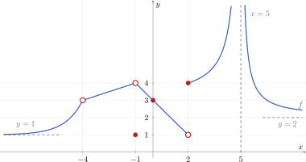
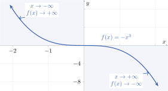
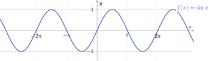

# Repàs de límits

En aquest apartat repassarem com s'interpreta un límit a partir de la gràfica d'una funció. La part analítica es treballarà després.

## 1. Interpretació gràfica

Quan $x$ s'apropa a un punt $a$, podem observar la funció des dels dos costats:

- el **límit per l'esquerra**, $\displaystyle\lim_{x\to a^-}f(x)$;
- el **límit per la dreta**, $\displaystyle\lim_{x\to a^+}f(x)$.

El límit $\displaystyle\lim_{x\to a}f(x)$ existeix quan els dos límits laterals coincideixen. El valor $f(a)$ és una informació diferent: pot coincidir amb el límit, ser diferent o no estar definit.

<figure markdown="span">
  { width="900" }
  <figcaption><strong><a href="https://github.com/albertcid-PA/Matematiques2BAT-MACS/blob/main/figures/tikz/analisi/fig_1_1_interpretacio_grafica_limits.tex">Figura 1.1.</a></strong> Interpretació gràfica dels límits.</figcaption>
</figure>

### Lectura dels punts destacats

| Punt$x=a$ | Límit per l'esquerra$\displaystyle\lim_{x\to a^-}f(x)=$ | Límit per la dreta$\displaystyle\lim_{x\to a^+}f(x)=$ | Límit$\displaystyle\lim_{x\to a}f(x)=$ | Valor de la funció$f(a)=$ | Interpretació&nbsp; |
|---|---:|---:|---:|---:|---|
| $x=-4$ | $3$ | $3$ | $3$ | No està definida | Discontinuïtat evitable |
| $x=-1$ | $4$ | $4$ | $4$ | $f(-1)=1$ | Evitable amb el punt desplaçat |
| $x=0$ | $3$ | $3$ | $3$ | $f(0)=3$ | Funció contínua |
| $x=2$ | $1$ | $4$ | No existeix | $f(2)=4$ | Discontinuïtat de salt finit |
| $x=5$ | $+\infty$ | $+\infty$ | $+\infty$ | No està definida | Discontinuïtat asimptòtica |

En particular:

- a $x=-4$, el límit existeix, però a la gràfica hi ha un forat;
- a $x=-1$, el límit existeix, però el valor de la funció està desplaçat;
- a $x=0$, es compleix $\displaystyle\lim_{x\to0}f(x)=f(0)=3$;
- a $x=2$, els límits laterals són diferents i, per tant, el límit no existeix;
- a $x=5$, la recta $x=5$ és una **asímptota vertical**.

### Límits a l'infinit

La gràfica també mostra que

$$
\lim_{x\to-\infty}f(x)=1
\qquad\text{i}\qquad
\lim_{x\to+\infty}f(x)=2.
$$

Per tant, $y=1$ és una asímptota horitzontal quan $x\to-\infty$ i $y=2$ és una asímptota horitzontal quan $x\to+\infty$.

Una funció també pot créixer o decréixer indefinidament. Per exemple, si $f(x)=-x^3$,

$$
\lim_{x\to-\infty}(-x^3)=+\infty
\qquad\text{i}\qquad
\lim_{x\to+\infty}(-x^3)=-\infty.
$$

<figure markdown="span">
  { width="700" }
  <figcaption><strong><a href="https://github.com/albertcid-PA/Matematiques2BAT-MACS/blob/main/figures/tikz/analisi/fig_1_2_comportament_infinits_menys_x_cub.tex">Figura 1.2.</a></strong> Comportament de $f(x)=-x^3$ als infinits.</figcaption>
</figure>

!!! note "Quan el límit a l'infinit no existeix"
    No totes les funcions s'apropen a un valor concret ni creixen cap a $+\infty$ o $-\infty$. Per exemple, $f(x)=\sin x$ oscil·la indefinidament entre $-1$ i $1$. Per això, $\displaystyle\lim_{x\to+\infty}\sin x$ i $\displaystyle\lim_{x\to-\infty}\sin x$ no existeixen.

    <figure markdown="span">
      { width="720" }
      <figcaption><strong><a href="https://github.com/albertcid-PA/Matematiques2BAT-MACS/blob/main/figures/tikz/analisi/fig_1_3_limit_inexistent_sinus.tex">Figura 1.3.</a></strong> Exemple de límit a l'infinit que no existeix.</figcaption>
    </figure>

## 2. Càlcul analític

### 2.1 Ordre dels infinits

Quan $x\to+\infty$, algunes funcions creixen més de pressa que d'altres. Direm que $f$ té un ordre d'infinit superior a $g$ si

$$
\lim_{x\to+\infty}\frac{f(x)}{g(x)}=+\infty.
$$

En les condicions adequades, l'ordre de creixement és

$$
\boxed{\text{exponencial}>\text{polinòmica}>\text{racional}>\text{logarítmica}}.
$$

Cal tenir en compte aquestes condicions:

- **Exponencial:** $a^x$, amb $a>1$. Si $0<a<1$, aleshores $a^x\to0$ quan $x\to+\infty$.
- **Polinòmica:** $P(x)$ es comporta com el seu terme de grau més alt. Si $P(x)=c_dx^d+\cdots$, aleshores $P(x)\sim c_dx^d$.
- **Racional:** si $R(x)=\dfrac{P_m(x)}{Q_n(x)}$, amb coeficients principals $p_m$ i $q_n$, aleshores

$$
R(x)\sim\frac{p_m}{q_n}x^{m-n}.
$$

- **Logarítmica:** $\log_b x$, amb $b>1$ i $x>0$.

Per tant, una funció racional queda entre una polinòmica de grau $d$ i un logaritme quan $m-n=k$ compleix $0<k<d$ i els coeficients principals són positius. En aquest cas,

$$
a^x\gg x^d\gg\frac{P_m(x)}{Q_n(x)}\sim\frac{p_m}{q_n}x^k\gg\log_b x,
\qquad a>1,\ b>1.
$$

Si $m=n$, la funció racional tendeix a un nombre; si $m<n$, tendeix a $0$. Per això, una funció racional no ocupa sempre la mateixa posició en l'ordre dels infinits.

!!! example "Exemple 1. Tots els tipus de funcions"
    Calculem

    $$
    \lim_{x\to+\infty}
    \frac{2^x+x^5+\dfrac{3x^3+1}{x^2+1}+\ln x}{2^x}.
    $$

    La funció racional es comporta com $3x$, perquè la diferència de graus és $3-2=1$. Per tant,

    $$
    2^x\gg x^5\gg\frac{3x^3+1}{x^2+1}\sim3x\gg\ln x.
    $$

    Dividint cada terme per $2^x$,

    $$
    1+\frac{x^5}{2^x}
    +\frac{3x^3+1}{(x^2+1)2^x}
    +\frac{\ln x}{2^x}
    \longrightarrow 1+0+0+0.
    $$

    Així doncs,

    $$
    \boxed{\displaystyle
    \lim_{x\to+\infty}
    \frac{2^x+x^5+\dfrac{3x^3+1}{x^2+1}+\ln x}{2^x}=1.}
    $$

!!! example "Exemple 2. Funció polinòmica"
    Calculem

    $$
    \lim_{x\to+\infty}\left(-4x^5+2x^3-7x+6\right).
    $$

    Traiem factor comú $x^5$:

    $$
    -4x^5+2x^3-7x+6
    =x^5\left(-4+\frac{2}{x^2}-\frac{7}{x^4}+\frac{6}{x^5}\right).
    $$

    El parèntesi tendeix a $-4$ i $x^5\to+\infty$. Per tant, domina el terme principal $-4x^5$ i

    $$
    \boxed{\displaystyle
    \lim_{x\to+\infty}\left(-4x^5+2x^3-7x+6\right)=-\infty.}
    $$

!!! example "Exemple 3. Funció racional que tendeix a un nombre"
    Calculem

    $$
    \lim_{x\to+\infty}\frac{6x^3-2x^2+5}{3x^3+x-4}.
    $$

    El numerador i el denominador tenen el mateix grau. Dividim tots els termes entre $x^3$:

    $$
    \lim_{x\to+\infty}
    \frac{6-\dfrac{2}{x}+\dfrac{5}{x^3}}
         {3+\dfrac{1}{x^2}-\dfrac{4}{x^3}}
    =\frac{6}{3}.
    $$

    Per tant,

    $$
    \boxed{\displaystyle
    \lim_{x\to+\infty}\frac{6x^3-2x^2+5}{3x^3+x-4}=2.}
    $$
